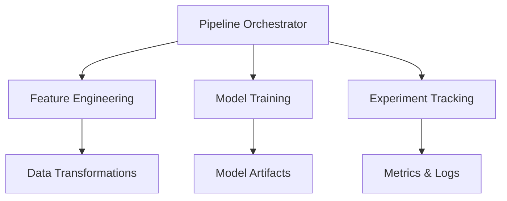

# Top-Notch-Data-Science-Project-Price-Prediction-Using-Core-ML-and-MLOps-Principles


## How to Run the Project
### I will add further screenshots how the output looks post execution

1. **Clone the Repository**:
   ```bash
   git clone <repo-link>
   ```
2. **Install Dependencies**:
   ```bash
   pip install -r requirements.txt
   ```
3. **ZenML and MLflow Setup Guide

```markdown


This guide provides step-by-step instructions for setting up ZenML with MLflow integration.

## Table of Contents
- [Installation](#installation)
- [Basic Setup](#basic-setup)
- [Component Registration](#component-registration)
- [Stack Configuration](#stack-configuration)
- [Verification](#verification)
- [Troubleshooting](#troubleshooting)
- [Best Practices](#best-practices)
- [Advanced Configuration](#advanced-configuration)
- [Clean Up](#clean-up)
```
## Installation

```bash
# Install required packages
pip install zenml
pip install mlflow>=2.1.1
```

## Basic Setup

Initialize ZenML repository:
```bash
zenml init
```

Check current environment:
```bash
# List all components to see what's already registered
zenml artifact-store list
zenml orchestrator list
zenml experiment-tracker list
zenml stack list
```

## Component Registration

Register required components:
```bash
# Register local artifact store
zenml artifact-store register local_store --flavor=local

# Register local orchestrator
zenml orchestrator register local_orchestrator --flavor=local

# Register MLflow experiment tracker
zenml experiment-tracker register mlflow --flavor=mlflow
```

## Stack Configuration

Create and set up MLflow stack:
```bash
# Register the stack with components
zenml stack register mlflow_stack \
    -a local_store \
    -o local_orchestrator \
    -e mlflow

# Set as active stack
zenml stack set mlflow_stack
```

## Verification

Verify the setup:
```bash
# Check registered stacks
zenml stack list

# Start MLflow UI (optional)
zenml up
```

## Troubleshooting

### Component Already Exists
```bash
# Delete existing components if needed
zenml artifact-store delete local_store
zenml orchestrator delete local_orchestrator
zenml experiment-tracker delete mlflow
```

### Check Component Details
```bash
zenml artifact-store describe local_store
zenml orchestrator describe local_orchestrator
zenml experiment-tracker describe mlflow
```

### Stack Issues
```bash
# Check stack configuration
zenml stack describe mlflow_stack

# Delete and recreate if needed
zenml stack delete mlflow_stack
```


```markdown
# House Price Prediction Pipeline

This project implements a machine learning pipeline for predicting house prices using ZenML and MLflow.

## Setup and Installation

1. Clone the repository:
```bash
git clone <repository-url>
cd <repository-name>
```

2. Install dependencies:
```bash
pip install "zenml[server]" mlflow scikit-learn pandas numpy
```

3. Set up environment (for Mac users):
```bash
export OBJC_DISABLE_INITIALIZE_FORK_SAFETY=YES
```

## Running the Pipeline

1. Initialize ZenML:
```bash
zenml init
```

2. Start the ZenML server:
```bash
zenml up
```

3. Run the pipeline:
```bash
python run_pipeline.py

(base) ankanmazumdar@Ankans-Air Top-Notch-Data-Science-Project-Price-Prediction-Using-Core-ML-and-MLOps-Principles-main % python run_pipeline.py
Using existing zip file: data/AmesHousing.csv.zip
Pipeline execution completed
Initiating a new run for the pipeline: ml_pipeline.
Using user: default
Using stack: mlflow_stack
  artifact_store: local_store
  experiment_tracker: mlflow
  orchestrator: local_orchestrator
Dashboard URL for Pipeline Run: http://127.0.0.1:8237/runs/4bbd1876-1cc8-4416-b8ed-51ba96bf2cee
Created new model version 11 for model prices_predictor.
Models can be viewed in the dashboard using ZenML Pro. Sign up for a free trial at https://www.zenml.io/pro/
Using cached version of step data_ingestion_step.
Using cached version of step handle_missing_values_step.
Using cached version of step feature_engineering_step.
Using cached version of step outlier_detection_step.
Using cached version of step data_splitter_step.
Step model_building_step has started.
Categorical columns: []
Numerical columns: ['Order', 'PID', 'MS SubClass', 'Lot Frontage', 'Lot Area', 'Overall Qual', 'Overall Cond', 'Year Built', 'Year Remod/Add', 'Mas Vnr Area', 'BsmtFin SF 1', 'BsmtFin SF 2', 'Bsmt Unf SF', 'Total Bsmt SF', '1st Flr SF', '2nd Flr SF', 'Low Qual Fin SF', 'Gr Liv Area', 'Bsmt Full Bath', 'Bsmt Half Bath', 'Full Bath', 'Half Bath', 'Bedroom AbvGr', 'Kitchen AbvGr', 'TotRms AbvGrd', 'Fireplaces', 'Garage Yr Blt', 'Garage Cars', 'Garage Area', 'Wood Deck SF', 'Open Porch SF', 'Enclosed Porch', '3Ssn Porch', 'Screen Porch', 'Pool Area', 'Misc Val', 'Mo Sold', 'Yr Sold']
Building and training the Linear Regression model.
2024/11/11 00:42:22 WARNING mlflow.utils.autologging_utils: MLflow autologging encountered a warning: "/opt/anaconda3/lib/python3.12/site-packages/mlflow/types/utils.py:407: UserWarning: Hint: Inferred schema contains integer column(s). Integer columns in Python cannot represent missing values. If your input data contains missing values at inference time, it will be encoded as floats and will cause a schema enforcement error. The best way to avoid this problem is to infer the model schema based on a realistic data sample (training dataset) that includes missing values. Alternatively, you can declare integer columns as doubles (float64) whenever these columns may have missing values. See `Handling Integers With Missing Values <https://www.mlflow.org/docs/latest/models.html#handling-integers-with-missing-values>`_ for more details."
2024/11/11 00:42:22 WARNING mlflow.utils.autologging_utils: MLflow autologging encountered a warning: "/opt/anaconda3/lib/python3.12/site-packages/mlflow/types/utils.py:407: UserWarning: Hint: Inferred schema contains integer column(s). Integer columns in Python cannot represent missing values. If your input data contains missing values at inference time, it will be encoded as floats and will cause a schema enforcement error. The best way to avoid this problem is to infer the model schema based on a realistic data sample (training dataset) that includes missing values. Alternatively, you can declare integer columns as doubles (float64) whenever these columns may have missing values. See `Handling Integers With Missing Values <https://www.mlflow.org/docs/latest/models.html#handling-integers-with-missing-values>`_ for more details."
Model training completed.
Model expects the following columns: ['Order', 'PID', 'MS SubClass', 'Lot Frontage', 'Lot Area', 'Overall Qual', 'Overall Cond', 'Year Built', 'Year Remod/Add', 'Mas Vnr Area', 'BsmtFin SF 1', 'BsmtFin SF 2', 'Bsmt Unf SF', 'Total Bsmt SF', '1st Flr SF', '2nd Flr SF', 'Low Qual Fin SF', 'Gr Liv Area', 'Bsmt Full Bath', 'Bsmt Half Bath', 'Full Bath', 'Half Bath', 'Bedroom AbvGr', 'Kitchen AbvGr', 'TotRms AbvGrd', 'Fireplaces', 'Garage Yr Blt', 'Garage Cars', 'Garage Area', 'Wood Deck SF', 'Open Porch SF', 'Enclosed Porch', '3Ssn Porch', 'Screen Porch', 'Pool Area', 'Misc Val', 'Mo Sold', 'Yr Sold']
/opt/anaconda3/lib/python3.12/site-packages/zenml/integrations/mlflow/experiment_trackers/mlflow_experiment_tracker.py:258: FutureWarning: ``mlflow.gluon.autolog`` is deprecated since 2.5.0. This method will be removed in a future release.
  module.autolog(disable=True)
Step model_building_step has finished in 12.696s.
Step model_evaluator_step has started.
Applying the same preprocessing to the test data.
Evaluating the model using the selected strategy.
Predicting using the trained model.
Calculating evaluation metrics.
Model Evaluation Metrics: {'Mean Squared Error': 0.010942367022909556, 'R-Squared': 0.9221139768594211}
Step model_evaluator_step has finished in 3.803s.
Pipeline run has finished in 17.841s.

MLflow Tracking URI: file:/Users/ankanmazumdar/Library/Application Support/zenml/local_stores/52bad07c-54cc-4ee6-b969-e7904b2144a5/mlruns
To start MLflow UI, run:
mlflow ui --backend-store-uri 'file:/Users/ankanmazumdar/Library/Application Support/zenml/local_stores/52bad07c-54cc-4ee6-b969-e7904b2144a5/mlruns'

ZenML Dashboard:
1. First run: zenml up
2. Then visit: http://127.0.0.1:8237
3. Default username is 'default' (no password needed)

Pipeline Run ID: 4bbd1876-1cc8-4416-b8ed-51ba96bf2cee
Status: completed
Start Time: 2024-11-11 06:42:16.597017

```

### Example Output:
```bash
Using existing zip file: data/AmesHousing.csv.zip
Pipeline execution completed
Initiating a new run for the pipeline: ml_pipeline.
Using user: default
Using stack: mlflow_stack
  artifact_store: local_store
  experiment_tracker: mlflow
  orchestrator: local_orchestrator
Dashboard URL for Pipeline Run: http://127.0.0.1:8237/runs/4bbd1876-1cc8-4416-b8ed-51ba96bf2cee

[... Model Training Output ...]

Model Evaluation Metrics: {
    'Mean Squared Error': 0.010942367022909556, 
    'R-Squared': 0.9221139768594211
}

Pipeline run has finished in 17.841s.
```

## Accessing the Dashboards

### MLflow Dashboard
1. Start MLflow UI:
```bash
mlflow ui --backend-store-uri 'file:/path/to/mlruns'
```
2. Visit: http://127.0.0.1:5000

### ZenML Dashboard
1. Ensure ZenML server is running
2. Visit: http://127.0.0.1:8237
3. Login:
   - Username: `default`
   - Password: (leave empty)

## Pipeline Steps
1. Data Ingestion
2. Missing Value Handling
3. Feature Engineering
4. Outlier Detection
5. Data Splitting
6. Model Building
7. Model Evaluation

## Performance Metrics
- Mean Squared Error: 0.0109
- R-Squared Score: 0.9221 (92.21% variance explained)

## Notes
- The pipeline uses caching for efficiency
- Model artifacts are tracked using MLflow
- Pipeline orchestration is handled by ZenML
- The model achieves 92.21% accuracy on the test set

## Troubleshooting
If you encounter issues:
1. Ensure all dependencies are installed
2. For Mac users, set the environment variable
3. Check ZenML server status with `zenml status`
4. Verify MLflow tracking URI is correct

## Additional Commands
```bash
# Check ZenML status
zenml status

# List all pipelines
zenml pipeline list

# List all runs
zenml pipeline runs list

# Stop ZenML server
zenml down
```

For more information, visit:
- [ZenML Documentation](https://docs.zenml.io)
- [MLflow Documentation](https://mlflow.org/docs/latest/index.html)


  

  

   


  
  

  

  


  


```markdown
# House Price Prediction with MLOps

## Table of Contents
1. [Project Overview](#project-overview)
2. [Architecture](#architecture)
3. [Key Components](#key-components)
4. [Setup & Installation](#setup--installation)
5. [Pipeline Execution](#pipeline-execution)
6. [Monitoring & Tracking](#monitoring--tracking)
7. [Design Patterns](#design-patterns)
8. [Performance](#performance)
9. [Troubleshooting](#troubleshooting)

## Project Overview
A production-grade house price prediction system implementing MLOps principles and best practices. The project achieves 92.21% accuracy using a combination of robust data processing, model training, and deployment pipelines.

### Dashboard Views
```


## Architecture

Based on the provided code, here's the architectural overview of the MLOps project:

# MLOps Project Architecture

## 1. Core Components

### Base Architecture
```
graph TD
    A[Data Pipeline] --> B[Feature Engineering]
    B --> C[Model Training]
    C --> D[Model Evaluation]
    D --> E[Experiment Tracking]
```

### Design Patterns Implementation

#### Strategy Pattern
- **Feature Engineering**

```164:198:src/feature_engineering.py
        return df_transformed
```

- Allows swapping different feature engineering approaches
- Implementations include: LogTransformation, StandardScaling, MinMaxScaling, OneHotEncoding

#### Abstract Factory Pattern
- **Data Splitting**

```11:27:src/data_splitter.py
# -----------------------------------------------
# This class defines a common interface for different data splitting strategies.
# Subclasses must implement the split_data method.
class DataSplittingStrategy(ABC):
    @abstractmethod
    def split_data(self, df: pd.DataFrame, target_column: str):
        """
        Abstract method to split the data into training and testing sets.

        Parameters:
        df (pd.DataFrame): The input DataFrame to be split.
        target_column (str): The name of the target column.

        Returns:
        X_train, X_test, y_train, y_test: The training and testing splits for features and target.
        """
        pass
```

- Provides interface for creating families of data splitting strategies

## 2. Pipeline Architecture

### Training Pipeline Flow
```
graph LR
    A[Data Ingestion] --> B[Missing Values]
    B --> C[Feature Engineering]
    C --> D[Outlier Detection]
    D --> E[Data Splitting]
    E --> F[Model Building]
    F --> G[Model Evaluation]
```

Reference Implementation:

```14:68:pipelines/training_pipeline.py
...
@pipeline(
    model=Model(
        # The name uniquely identifies this model
        name="prices_predictor"
    ),
    enable_cache=True
)
def ml_pipeline():
    """Define an end-to-end machine learning pipeline."""

    try:
        # Find zip files in the data directory
        zip_files = glob.glob("data/*.zip")
        
        if not zip_files:
            # If no zip file found, check if CSV exists in extracted_data
            if os.path.exists("extracted_data/AmesHousing.csv"):
                print("No zip file found, but using existing CSV in extracted_data/")
                # Create data directory if it doesn't exist
                os.makedirs("data", exist_ok=True)
                # Create zip file from existing CSV
                shutil.make_archive("data/AmesHousing", 'zip', "extracted_data", "AmesHousing.csv")
                file_path = "data/AmesHousing.zip"
            else:
                raise FileNotFoundError("Neither zip file nor CSV file found. Please ensure data is available.")
        else:
            file_path = zip_files[0]
            print(f"Using existing zip file: {file_path}")

        # Data Ingestion Step
        raw_data = data_ingestion_step(file_path=file_path)

        # Handling Missing Values Step
        filled_data = handle_missing_values_step(raw_data)
@pipeline(
    model=Model(
        # The name uniquely identifies this model
        name="prices_predictor"
    ),
    enable_cache=True
)
def ml_pipeline():
        ...
        # Feature Engineering Step
        engineered_data = feature_engineering_step(
            filled_data, strategy="log", features=["Gr Liv Area", "SalePrice"]
        )

        # Outlier Detection Step
        clean_data = outlier_detection_step(engineered_data, column_name="SalePrice")

        # Data Splitting Step
        X_train, X_test, y_train, y_test = data_splitter_step(clean_data, target_column="SalePrice")
```


## 3. Experiment Tracking Integration

### MLflow Integration
```
graph TD
    A[Pipeline Run] --> B[MLflow Tracker]
    B --> C[Metrics Logging]
    B --> D[Parameter Logging]
    B --> E[Artifact Storage]
```

Implementation:

```63:103:.venv/lib/python3.9/site-packages/zenml/integrations/mlflow/experiment_trackers/mlflow_experiment_tracker.py
class MLFlowExperimentTracker(BaseExperimentTracker):
    """Track experiments using MLflow."""

    def __init__(self, *args: Any, **kwargs: Any) -> None:
        """Initialize the experiment tracker and validate the tracking uri.

        Args:
            *args: Variable length argument list.
            **kwargs: Arbitrary keyword arguments.
        """
        super().__init__(*args, **kwargs)
        self._ensure_valid_tracking_uri()

    def _ensure_valid_tracking_uri(self) -> None:
        """Ensures that the tracking uri is a valid mlflow tracking uri.

        Raises:
            ValueError: If the tracking uri is not valid.
        """
        tracking_uri = self.config.tracking_uri
        if tracking_uri:
            valid_schemes = DATABASE_ENGINES + ["http", "https", "file"]
            if not any(
                tracking_uri.startswith(scheme) for scheme in valid_schemes
            ) and not is_databricks_tracking_uri(tracking_uri):
                raise ValueError(
                    f"MLflow tracking uri does not start with one of the valid "
                    f"schemes {valid_schemes} or its value is not set to "
                    f"'databricks'. See "
                    f"https://www.mlflow.org/docs/latest/tracking.html#where-runs-are-recorded "
                    f"for more information."
                )

    @property
    def config(self) -> MLFlowExperimentTrackerConfig:
        """Returns the `MLFlowExperimentTrackerConfig` config.

        Returns:
            The configuration.
        """
        return cast(MLFlowExperimentTrackerConfig, self._config)
```


```

```


## 4. Component Interactions



## 5. Key Features

1. **Modularity**
   - Interchangeable components via Strategy Pattern
   - Pluggable experiment trackers

2. **Extensibility**
   - Abstract base classes for new implementations
   - Support for multiple tracking platforms

3. **Reproducibility**
   - Tracked experiments
   - Version controlled artifacts
   - Configurable pipeline steps

4. **Monitoring**
   - Integrated logging
   - Metric tracking
   - Experiment comparison

This architecture ensures:
- Clean separation of concerns
- Easy maintenance and testing
- Flexible experiment tracking
- Scalable pipeline operations

## Key Components

### Core ML Pipeline
```python:pipelines/training_pipeline.py
startLine: 14
endLine: 80
```

### Data Analysis
Based on EDA findings:
```python:analysis/EDA.ipynb
startLine: 389
endLine: 440
```

### MLOps Integration
- **ZenML**: Orchestration framework
- **MLflow**: Experiment tracking and model registry
- **CI/CD**: Automated training and deployment pipelines

## Setup & Installation

### Prerequisites
```bash
pip install "zenml[server]" mlflow scikit-learn pandas numpy
export OBJC_DISABLE_INITIALIZE_FORK_SAFETY=YES  # For Mac users
```

### Pipeline Execution
```bash
zenml init
zenml up
python run_pipeline.py
```

## Design Patterns


### Factory Pattern
Used for data ingestion with configurable data sources:
- **Concept**: Like a coffee machine producing different types of coffee
- **Implementation**: Standardized data loading interface

### Strategy Pattern
Payment processing analogy:
- **Interface**: PaymentMethod
- **Implementations**: CreditCard, PayPal, Bitcoin
- **Context**: ShoppingCart

### Template Pattern
Restaurant menu analogy:
- **Template**: Dining sequence
- **Customization**: Cuisine-specific dishes
- **Implementation**: Data processing pipeline steps

## Monitoring & Tracking

### MLflow Dashboard
```bash
mlflow ui --backend-store-uri 'file:/path/to/mlruns'
```
Access at: http://127.0.0.1:5000

### ZenML Dashboard
- URL: http://127.0.0.1:8237
- Credentials: username: `default`, no password

### Performance Metrics
- MSE: 0.0109
- R² Score: 0.9221

## Pipeline Steps
1. Data Ingestion
2. Missing Value Handling
3. Feature Engineering
4. Outlier Detection
5. Data Splitting
6. Model Building
7. Model Evaluation

## Troubleshooting

### Common Issues
1. ZenML Server:
```bash
zenml status
zenml down  # Stop
zenml up    # Restart
```

2. MLflow Connection:
- Check tracking URI
- Verify port availability

### Useful Commands
```bash
zenml pipeline list
zenml pipeline runs list
```

## Additional Resources
- [ZenML Docs](https://docs.zenml.io)
- [MLflow Docs](https://mlflow.org/docs/latest/index.html)


## Summary
**"Building a Top-Notch Data Science Project: House Price Prediction Using Core ML and MLOps Principles"**

This project demonstrates the combined use of core ML techniques and MLOps principles to build a robust, production-grade pipeline for house price prediction. It includes CI/CD, experiment tracking, and design patterns that ensure the model is reproducible, scalable, and aligned with industry standards.

## Key Components

### Core ML
- **Focus on Data Understanding**: Time is allocated for thorough data analysis and assumption testing, which significantly influences algorithm selection and feature engineering steps.
- **Model Compatibility**: Data validation and assumption checks are integrated to ensure the chosen model performs effectively on the dataset.

### MLOps
- **Comprehensive MLOps Framework**: Integrates tools
-  ZenML (easy to use orchestrated MLOps framework seamlessly integrating other ML tools/workflows to build fullstack of it, relatively easy to understand, we understand the pipelins workflows) and MLFlow (inegration of ZenML where we use to track our deployments for a production-ready ML pipeline.

  

- **Pipeline Automation**: CI/CD pipelines automate the flow from data ingestion through deployment, enhancing reproducibility and robustness.

### Code Quality
- **Adoption of Design Patterns**: Uses design patterns (Factory, Strategy, Template) across modules, making code scalable, modular, and easier to maintain.


Factory Design Pattern

Imagine you run a coffee shop. Customers can order different types of coffee, but the process of
making coffee follows a similar pattern. You have a general coffee-making machine (the factory)
that can be used to make different types of coffee (products) like Espresso, Latte, or Cappuccino.
CoffeeMachine (Factory): Has a method to make coffee
• Espresso, Latte, Cappuccino (ConcreteProducts): Different types of coffee that can be
made by the machine.

Strategy Pattern

Imagine you're developing an e-commerce application. Customers can choose different payment
methods like Credit Card, PayPal, or Bitcoin. Each payment method has a different implementation,
but the overall process is the same: the customer pays for the order.
• PaymentMethod (Strategy): An interface that defines how payments are processed.
• CreditCardPayment, PayPalPayment, BitcoinPayment (ConcreteStrategies): Different
implementations of payment processing.
• ShoppingCart (Context): Uses a payment method to process a customer's payment.

Template Pattern

Real-World Analogy:
Imagine you run a restaurant with a set menu for different cuisines. Each cuisine (like Italian,
Chinese, or Indian) has a specific sequence of courses: appetizer, main course, dessert, and
beverage. The sequence of serving these courses is the same, but the dishes served at each step
vary depending on the cuisine.
For example, in an Italian meal, the appetizer might be bruschetta, the main course could be pasta
dessert might be tiramisu, and the beverage could be a glass of wine. In a Chinese meal, the
appetizer could be spring rolls, the main course might be stir-fried noodles, dessert could be
fortune cookies, and the beverage could be tea.
The template here is the overall dining sequence: appetizer, main course, dessert, and beverage.
The customizable steps are the specific dishes served at each stage, which change based on the
cuisine.

---
## Why Understanding and validating data are crucial in data science and machine learning
Here's a well-organized and comprehensive README format that emphasizes the importance of understanding and validating data, includes bullet points, and follows a structured sequence. 

---

## Why is Data Understanding and Validation Crucial?

- In machine learning, many focus solely on training and evaluating models, overlooking the importance of the underlying data.
- Building a robust, adaptable model requires continual refinement and insights derived from data.
- This project showcases a single model implementation but encourages testing with various models in the future.

## Project Plan Overview

This project will be structured as follows:
- **Project Structure**: Outlining a systematic approach to data handling and model development.
- **Data Sources**: Identifying and integrating reliable data sources.
- **Model Deployment**: Enabling production-ready model implementation.
- **Design Patterns**: Using patterns like Factory, Strategy, and Template for scalability and modularity.

## Key Design Patterns Utilized

1. **Factory Pattern**:
   - Facilitates code reproducibility and scalability by preparing different product instances.
   - Example: Different types of coffee prepared with similar methods, allowing flexibility in instance creation.
  
2. **Strategy Pattern**:
   - Allows flexible handling of various payment methods in e-commerce, with a strategy interface for consistency.
  
3. **Template Pattern**:
   - Frequently used in missing value analysis to implement a sequence of steps that can vary per data type.

## CI/CD Integration & Experiment Tracking

- **CI/CD Pipelines**: Integrated for continuous deployment and monitoring.
- **MLflow**: For experiment tracking.
- **ZenML**: Orchestrates experiment flows and model deployment.

## Data Ingestion and Processing

- **Ingest Method**: Accepts a file path as input and outputs a data frame, with type checks and docstrings for readability.
- **Handling File Types**:
  - Ensures non-zip files are skipped, while zip files are extracted for CSV processing.
  - Abstract classes handle data formats like JSON automatically, improving modularity.

## Data Analysis & Exploratory Data Analysis (EDA)

- **Analyze Source & EDA**:
  - Data inspection techniques include missing value and multivariate analysis.
  - EDA is used for data visualization.
  
- **Data Inspection Strategy**:
  - Abstract data inspection interface enables subclass-specific data inspections.
  - Summary statistics help in understanding numerical and categorical distributions.
  
- **Missing Value Analysis**:
  - Two approaches: Dropping or filling (mean, median, mode) missing values.
  - Heatmaps visualize the distribution and structure of missing data using Seaborn.

## Data Preprocessing for Regression Analysis

- **Outliers & Feature Engineering**:
  - Handling outliers and applying transformations to skewed features.
  - Encoding strategies such as one-hot encoding.
  
- **Visualization**:
  - Kernel density estimates and histograms analyze target variable distribution.

- **Outlier Detection**:
  - **Z-score Detection**: Identifies outliers using standard deviation.
  - **Capping**: Replaces extreme values with upper/lower limits.

## Model Building in AI

1. **Data Splitting**:
   - Essential for validating model performance.
2. **Feature Scaling**:
   - **Standard Scaler**: Ensures zero mean and unit variance, optimal for training.
3. **Pipeline Creation**:
   - Implements transformations and feature scaling for both categorical and numerical data.
4. **MLflow Setup**:
   - Tracks experiments, comparing feature transformations and experiment runs.

---
## Detailed Project Structure

### Data Loading & Ingestion
- **Why Factory Design Pattern**: The Factory pattern is utilized to handle various data formats dynamically. It provides flexibility in data ingestion by creating different "products" (i.e., data types like CSV, JSON, zip) from a single "factory" (data ingestion class). This design ensures scalability and the capacity to adapt to additional data types with minimal changes.
- **How It’s Better**: Unlike hardcoded file handlers, this approach uses a generalized interface to recognize and process different data formats automatically. It saves time and simplifies adding new formats by extending a base class instead of editing existing code.
- **Implementation**:
  - **Data Source Versatility**: The Factory pattern manages all data sources and formats through its extensible interface.
  - **Type Checking & Error Handling**: Validates file types before ingestion, preventing issues that arise from unsupported file types. For instance, zip files are verified and extracted using Python’s `zipfile` library, ensuring only valid data is processed.
- **Other Options & Comparison**: Traditional hardcoded ingestion scripts can handle specific formats but lack scalability, require significant manual code adjustments, and are challenging to maintain across multiple formats.

### Exploratory Data Analysis (EDA)
- **Why Julius AI**: Julius AI is incorporated for fast, thorough data analysis, quick insights, and visualizations, significantly reducing the time spent on manual EDA. It supports interactive data visualizations and quick experimentation, allowing for a more insightful and streamlined approach to data exploration.
- **How It’s Better**: Compared to traditional manual EDA, Julius AI saves considerable time and effort by automating many exploratory steps. It includes community suggestions and pre-built workflows that aid in feature selection, multivariate analysis, and identifying relationships between variables, thus creating a solid foundation for model-building decisions.

- 

- **EDA Strategy Pattern**: The Strategy pattern allows easy switching between various data inspection strategies, such as summary statistics, missing value analysis, and multivariate relationships. By defining these strategies as separate modules, EDA becomes modular and easily extendable.
  - **Scalability**: This structure ensures EDA steps are reusable, well-organized, and easily adaptable to new datasets or analysis needs.
- **Other Options & Comparison**: Performing EDA manually in a Jupyter notebook can work for smaller projects but is labor-intensive and error-prone for larger datasets. Julius AI, paired with the Strategy pattern, offers a faster, structured, and replicable alternative.

### Handling Missing Values & Outliers
- **Why Template Design Pattern**: To manage missing values effectively, a Template pattern is used to create reusable structures for missing value analysis. This approach standardizes handling processes, making it easier to spot missing patterns and structure preprocessing steps accordingly.
  - **Seaborn Heatmaps**: Heatmaps are used to visualize missing data distributions, with structured and random missingness guiding preprocessing decisions.
- **Outlier Detection & Normalization**: Outliers are detected using the Z-score method, which is a statistical approach that flags data points significantly deviating from the mean. This method is reliable for identifying unusual values in continuous data and supports decision-making in feature engineering.

  

- **How It’s Better**:
  - **Template Pattern Benefits**: By setting a base class for missing value analysis, handling missing data becomes modular, adaptable, and standardized, which is particularly useful for larger, complex datasets.
  - **Automated Z-Score Analysis**: Compared to manual outlier checks, Z-score automates and simplifies the identification of outliers, ensuring that skewed values are treated consistently.
- **Other Options & Comparison**: Traditional approaches, such as manual thresholding for outliers, lack standardization and scalability. The Template pattern with Z-score outlier detection provides a robust and systematic alternative, especially in production settings where consistency is critical.

### Feature Engineering
- **Why Use One-Hot Encoding & Standard Scaling**: One-hot encoding handles categorical variables efficiently, transforming them into a format that machine learning models can interpret. Standard scaling ensures that numerical features have a mean of zero and a standard deviation of one, making them suitable for algorithms sensitive to feature scaling.
  - **Log Transformations**: Log transformations are applied to certain features to reduce skewness and improve model interpretability.
- **How It’s Better**:
  - **Standard Scaling**: Normalizes the data, which is crucial for models that rely on distance-based calculations (e.g., linear regression, SVM).
  - **Automated Feature Pipeline**: The transformation process is embedded into the pipeline, ensuring the same transformations are applied every time, regardless of new data.
- **Other Options & Comparison**: While one-hot encoding and standard scaling are common, their automation within a pipeline ensures consistency across multiple runs, reducing the risk of human error and enhancing model reproducibility.

### Modeling & Deployment
- **Experiment Tracking & Deployment**: Using MLFlow, experiments are tracked meticulously, providing insights into model performance across different runs and configurations. This allows for quick model selection based on tracked metrics.
- **CI/CD Pipeline**: Automated testing and deployment ensure that any new model iteration is rigorously tested and ready for production without manual intervention.
- **How It’s Better**: Traditional deployment methods lack robust tracking and version control, making it challenging to reproduce or improve models. The automated CI/CD pipeline with experiment tracking addresses these limitations, creating a streamlined deployment process.
- **Other Options & Comparison**: Manual deployment lacks the scalability and consistency required for production-grade models. MLFlow and ZenML create an effective ecosystem for deploying and maintaining models, even as new data or changes are introduced.

---

## Tools & Libraries

- **ZenML**: Orchestrates MLOps pipelines, improving the management and scalability of machine learning workflows.

  

  


- **MLFlow**: Tracks experiments and manages model deployment, essential for production-level tracking and deployment consistency.

  

- **Julius AI**: Assists in EDA, providing quick insights, visualizations, and supporting in-depth data analysis.
  
- 

- **Pandas & NumPy**: Core libraries for data manipulation.
- **Seaborn**: Used for visualizations during EDA, especially for correlation analysis and missing value heatmaps.

---


